# M2SDR Getting Started Guide

## Table of Contents

1. Interface Overview
2. LED Indicators
3. Environment Setup

## 1. Interface Overview

There are 9 external interfaces in total, as shown in the figure below:

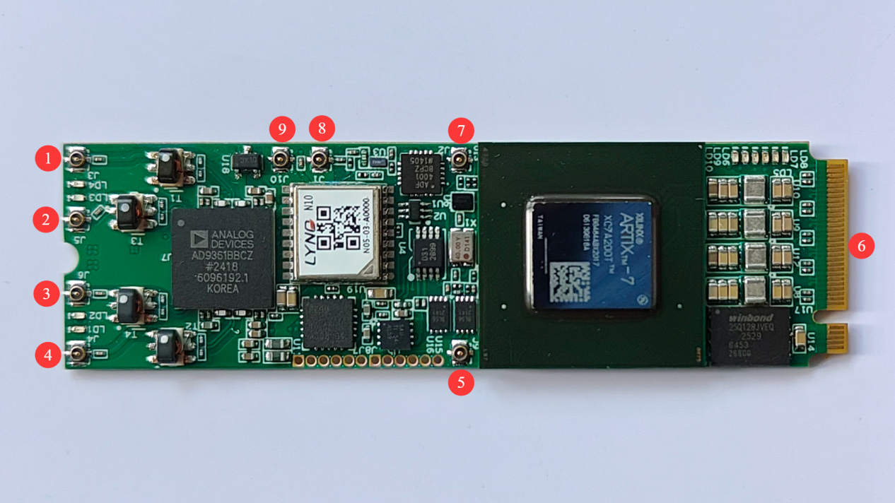

1. **TXA** — Transmit port of Channel A.
2. **RXA** — Receive port of Channel A. Input power must not exceed 0 dBm.
3. **RXB** — Receive port of Channel B. Input power must not exceed 0 dBm.
4. **TXB** — Transmit port of Channel B.
5. PPS synchronization signal input.
6. PCIe via the M.2 connector.
7. 40 MHz clock output, with a peak-to-peak amplitude of approximately 300 mV.
8. Connection for an external active clock input; UHD expects a default frequency of 10 MHz.
9. Connection for a GPS active antenna, enabling the GPSDO function.

## 2. LED Indicators

There are 10 LEDs in total, numbered LD1–LD10. Their meanings are listed below:

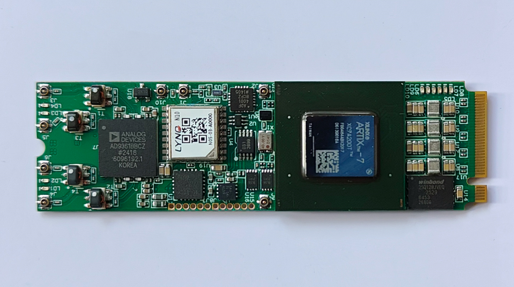

- **LD1**: Red — TXB indicator.
- **LD2**: Green — RXB indicator.
- **LD3**: Green — RXA indicator.
- **LD4**: Red — TXA indicator.
- **LD5**: Red — currently undefined.
- **LD6**: Yellow — currently undefined.
- **LD7**: Purple — currently undefined.
- **LD8**: Green — currently undefined.
- **LD9**: Yellow — currently undefined.
- **LD10**: Blue — DONE indicator.

## 3. Environment Setup

### 3.1 Detecting the Device

Insert the M2SDR into an M.2 NVMe slot on the host computer. After booting, enter the following command in a terminal. As shown in the figure, if the content highlighted in the red box appears, the device has been detected. If the device is not detected, try rebooting or inserting the card into a different M.2 slot.

Command: `lspci | grep Xil`

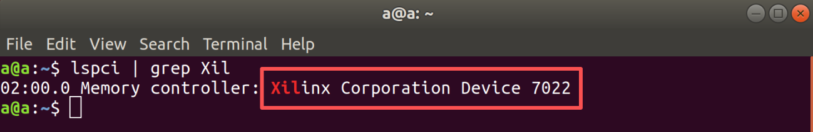

### 3.2 Loading the Driver

The driver source code is included in the cloud drive under `M2SDR_Support_Files\UHD_Mode\b210_model_pcie_drv_r25.zip` (copy the file to a Linux system). Extract it, change into the extracted directory in the terminal, and type `make` to build the driver. A build screenshot is shown below.

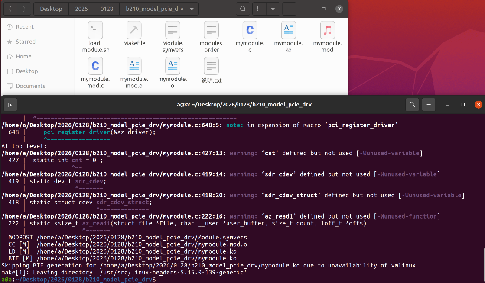

After the driver builds successfully, run the following command to load it. No output means the driver was loaded successfully.

Command: `sudo bash ./load_module.sh`

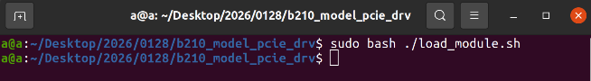

You can verify the driver is loaded with the following command:

Command: `ls /dev/FPGA`

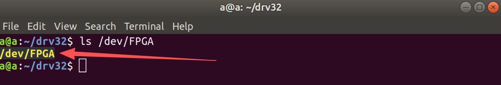

### 3.3 Installing UHD

The provided UHD drivers come in 7 versions for x64 and ARM architectures, ranging from 4.2 to 4.8 (due to version updates, the number of UHD versions offered may decrease or increase — refer to the actual directory contents). Choose according to your needs. Note: before installing our UHD driver, please first install the same version of the official stock UHD driver to make sure your system environment can support that UHD version. File directory: `M2SDR_Support_Files\UHD_Mode`.

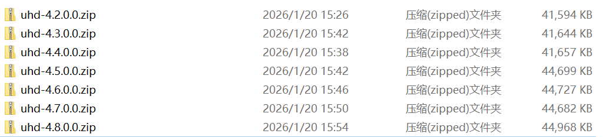

Copy the desired UHD installer to a Linux system and extract it. Enter the `host` directory, then run the following command to install UHD automatically (the screenshot is outdated — for the latest files, simply run `sudo ./install_uhd.sh`):

```bash
sudo ./install_uhd.sh
```

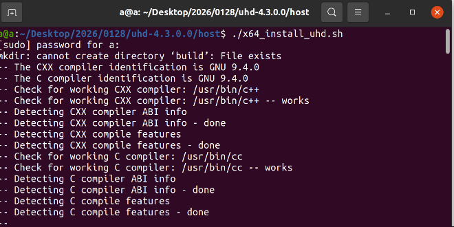

Once the UHD driver installation completes, it will appear as shown below.

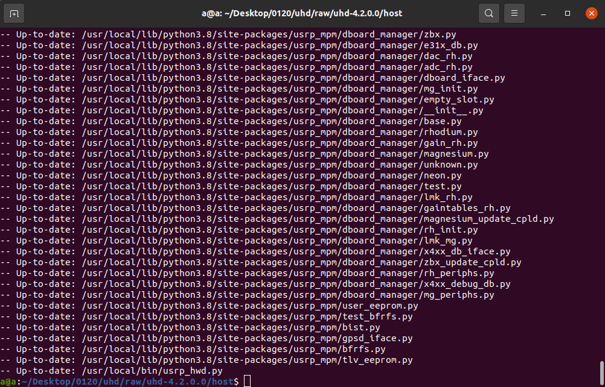

Run the following command to verify the test environment was set up correctly. A successful result looks like the screenshot below. In the printed output you will see the UHD version information, the onboard GPSDO information, and so on.

Command: `sudo uhd_usrp_probe`

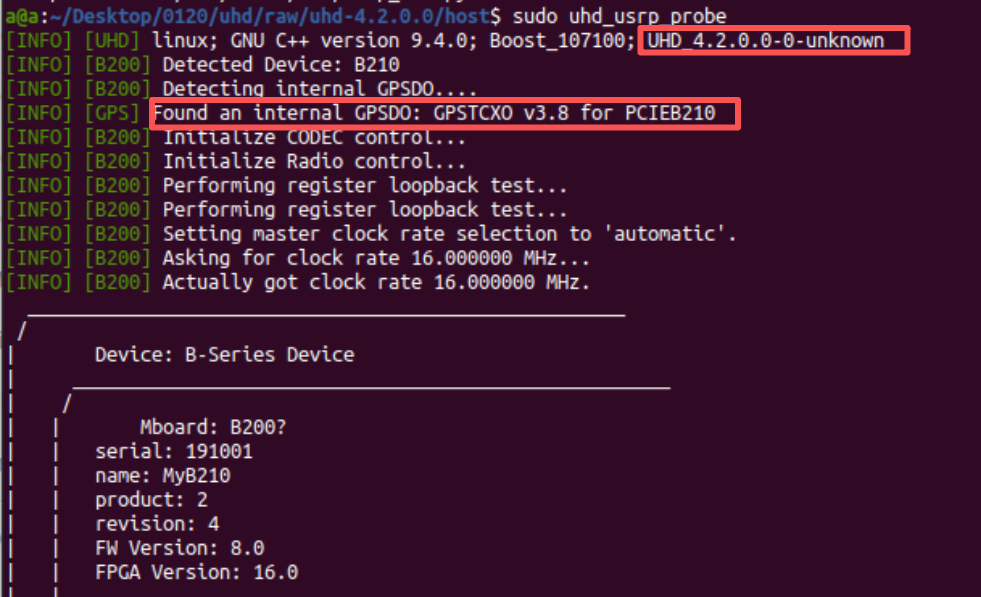

The full output of the `sudo uhd_usrp_probe` command is shown below.

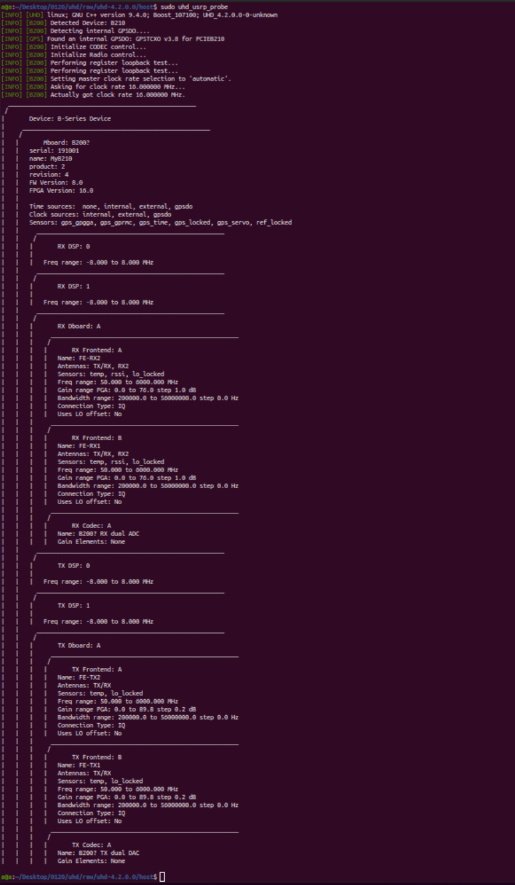
